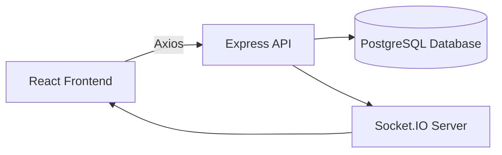

# 🧩 Task Manager App

> A **collaborative task management web application** where teams can create projects, manage tasks, and see updates in **real-time** — built using **React, Node.js, Express, PostgreSQL, and Socket.IO**.

---

## 🚀 Features

✅ Real-time task updates (Socket.IO)  
✅ Secure JWT authentication  
✅ RESTful API design (CRUD operations)  
✅ Password hashing with bcrypt  
✅ React Context + Custom Hooks for global state  
✅ PostgreSQL database integration  
✅ Axios for HTTP requests  
✅ Protected routes with role-based access  

---

## 🏗️ Tech Stack

| Layer | Technology | Description |
|--------|-------------|-------------|
| **Frontend** | React | Interactive UI (component-based) |
| | React Router | Smooth navigation without page reloads |
| | Axios | Communicates with backend APIs |
| | Socket.IO Client | Real-time updates instantly |
| **Backend** | Node.js + Express | Handles API requests & logic |
| | Socket.IO Server | Manages live updates for all users |
| | JWT | Authentication & authorization |
| | bcrypt | Encrypts user passwords |
| **Database** | PostgreSQL | Stores users, projects, and tasks |

---

## 🧭 Table of Contents

- [📚 Project Overview](#-project-overview)
- [⚙️ Installation & Setup](#️-installation--setup)
- [🗂️ File Structure](#️-file-structure)
- [🔄 Data Flow Example](#-data-flow-example)
- [🔐 Authentication Flow](#-authentication-flow)
- [🌐 Real-Time Communication](#-real-time-communication)
- [💡 Key Concepts](#-key-concepts)
- [🎓 Learning Outcomes](#-learning-outcomes)

---

## 📚 Project Overview

The **Task Manager App** lets users:
- Create and manage projects  
- Add, edit, and delete tasks  
- Collaborate with teammates  
- Get **real-time updates** without refreshing  

Think of it as a simplified version of **Trello** or **Asana** — perfect for teams managing daily workflows.

---

## ⚙️ Installation & Setup

### 1️⃣ Clone the repository
```bash
git clone https://github.com/yourusername/task-manager.git
cd task-manager
````

### 2️⃣ Install dependencies

```bash
cd client && npm install
cd ../server && npm install
```

### 3️⃣ Configure environment variables

Create a `.env` file inside `/server`:

```
DATABASE_URL=your_postgres_url
JWT_SECRET=your_secret_key
PORT=5000
```

### 4️⃣ Run the app

```bash
# Run backend
cd server
npm run dev

# Run frontend
cd ../client
npm start
```

---

## 🗂️ File Structure

### 🖥️ Client (Frontend)

```
client/src/
├── components/
│   ├── auth/             # Login, Register, Protected Routes
│   ├── common/           # Shared UI components
│   └── tasks/            # Task-related components
│
├── context/
│   ├── AuthContext.jsx   # Manages login state
│   └── SocketContext.jsx # Handles real-time socket connection
│
├── hooks/
│   ├── useAuth.js        # Custom hook for AuthContext
│   └── useSocket.js      # Custom hook for SocketContext
│
├── pages/
│   ├── Home.jsx
│   ├── Dashboard.jsx
│   ├── Projects.jsx
│   └── ProjectDetail.jsx
│
├── utils/
│   └── api.js            # Axios instance setup
│
├── App.jsx               # Root component
└── index.js              # Entry point
```

### ⚙️ Server (Backend)

```
server/src/
├── config/
│   └── database.js       # PostgreSQL connection setup
│
├── controllers/
│   ├── auth.controller.js
│   ├── projects.controller.js
│   └── tasks.controller.js
│
├── middleware/
│   └── auth.js           # JWT verification
│
├── routes/
│   ├── auth.routes.js
│   ├── projects.routes.js
│   └── tasks.routes.js
│
├── socket/
│   └── socketHandler.js  # Real-time event handlers
│
├── utils/
│   └── jwt.js            # Token creation & verification
│
└── server.js             # Entry point (starts the server)
```

---

## 🔄 Data Flow Example

### 🧩 User Creates a Task

```
1️⃣ User fills task form → clicks “Create Task”
2️⃣ Frontend sends POST request using Axios with JWT token
3️⃣ Backend verifies JWT via middleware
4️⃣ Controller saves task in PostgreSQL
5️⃣ Socket.IO emits “task-created” event
6️⃣ All connected clients update in real time 🚀
```

---

## 🔐 Authentication Flow

### 🔸 Registration

1. User enters email, username, password
2. Password hashed via **bcrypt**
3. User saved in **PostgreSQL**
4. JWT token created and sent to client
5. Frontend stores token in **localStorage**

### 🔸 Login

1. User enters credentials
2. Backend validates & compares hashed password
3. If valid → new JWT generated
4. Client stores token & grants access to protected routes

---

## 🌐 Real-Time Communication

### Without Socket.IO

```
User A creates a task → User B must refresh page to see it ❌
```

### With Socket.IO

```
User A creates a task → Server broadcasts instantly → User B sees update live ✅
```

**Socket Events Used:**

* `task-created`
* `task-updated`
* `task-deleted`
* `task-status-changed`
* `comment-added`

---

## 💡 Key Concepts

| Concept                | Description                                              |
| ---------------------- | -------------------------------------------------------- |
| **REST API**           | Defines standard CRUD endpoints (GET, POST, PUT, DELETE) |
| **JWT Authentication** | Stateless token-based login                              |
| **React Context**      | Global state management without prop drilling            |
| **Middleware**         | Security checkpoint for verifying users                  |
| **Socket.IO**          | Enables bi-directional, real-time data flow              |

---

## 🎓 Learning Outcomes

### 🎨 Frontend

* Component-based architecture
* State & effect management (`useState`, `useEffect`)
* Context API & custom hooks
* Routing (React Router)
* API integration with Axios

### ⚙️ Backend

* RESTful API design (Express.js)
* Database queries (PostgreSQL)
* Middleware & authentication (JWT)
* Password encryption (bcrypt)
* Error handling & modular structure

### ⚡ Advanced

* Real-time updates via Socket.IO
* Environment variable configuration
* Axios interceptors for token handling

---
## 📊 System Architecture (Visual)



**👨‍💻 Author:** [Abdullah Shakeel](https://github.com/abdu1lah26)
⭐ If you like this project, consider giving it a **star** on GitHub!
